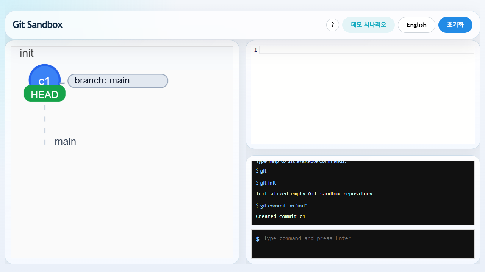
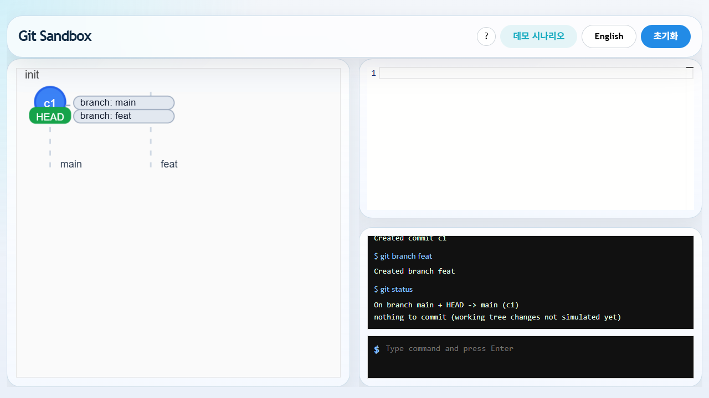
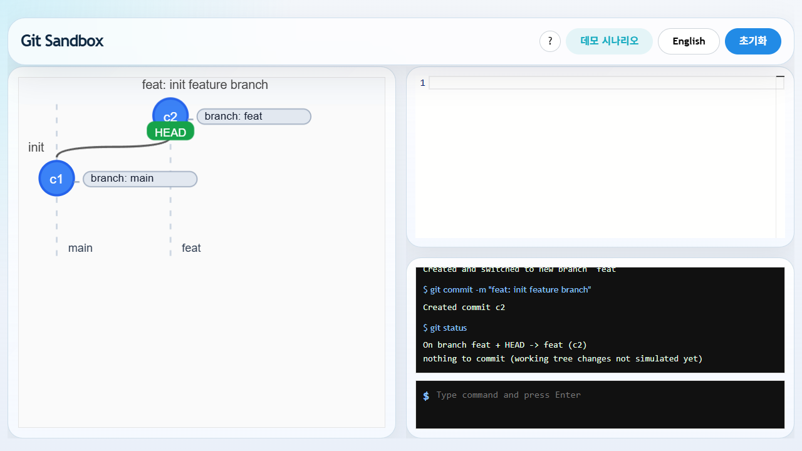
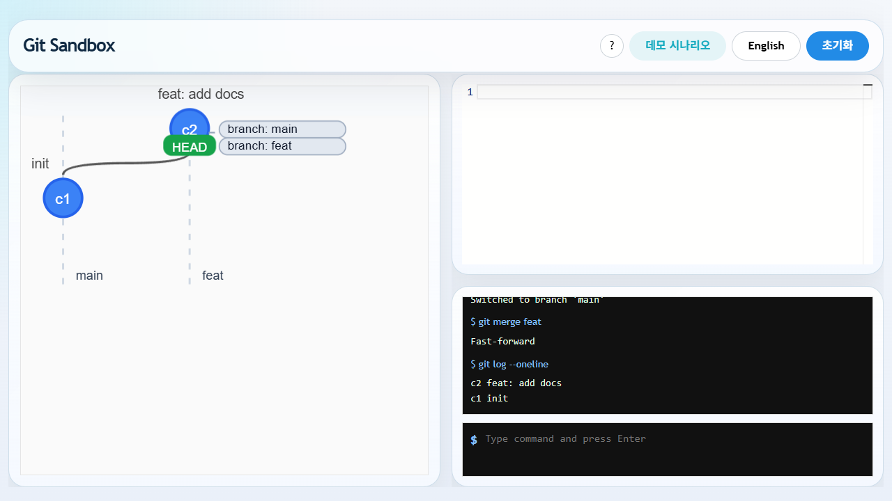
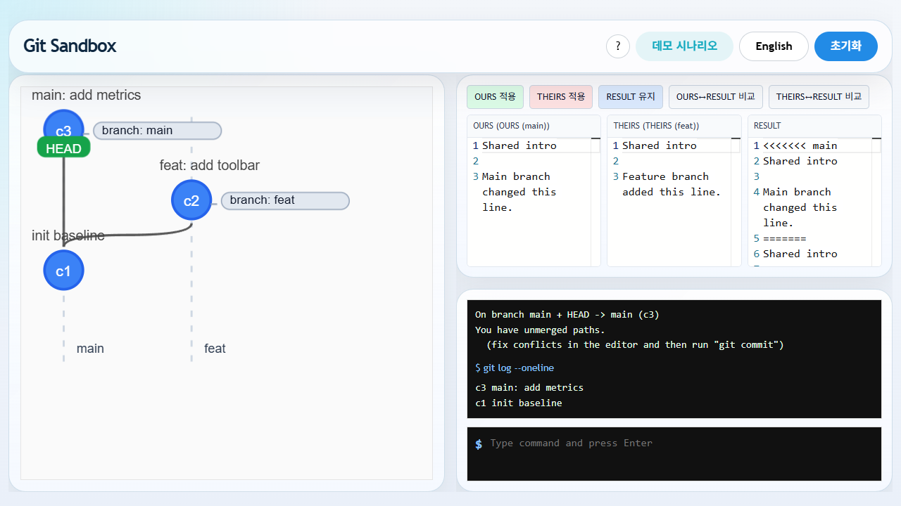

# Git Sandbox

Git Sandbox는 브라우저에서 Git 명령 흐름을 시각적으로 학습할 수 있는 `Vite + React + TypeScript` 기반 앱입니다.

왼쪽에는 커밋 그래프를, 오른쪽에는 에디터와 터미널을 배치해 `branch`, `switch`, `checkout`, `merge`, `revert`, `reset` 같은 흐름을 한 화면에서 확인할 수 있습니다. 머지 충돌이 발생하면 `ConflictResolver` UI가 `OURS / THEIRS / RESULT` 패널을 제공해 충돌 해결 과정을 직접 비교할 수 있습니다.

## 주요 기능

- Git 학습용 시각화 UI
- 커밋 DAG와 브랜치 상태 표시
- Monaco 기반 에디터
- 터미널 명령 실행 및 히스토리 확인
- `ko / en` 로케일 전환
- 튜토리얼 모달과 데모 시나리오 카탈로그
- 머지 충돌 해결 UI
- `git merge --abort` 지원
- Vitest + Testing Library + Playwright 테스트 구성

## 지원 명령어

- `help`
- `git init`
- `git commit -m <msg>`
- `git branch <name>`
- `git switch <name>`
- `git switch -c <name>`
- `git checkout <branch|commitId>`
- `git merge <name>`
- `git merge --abort`
- `git revert <commitId>`
- `git reset --hard <commitId>`
- `git status`
- `git log --oneline`

## 현재 구현 동작

- `git init`
  - `main` 브랜치에 symbolic `HEAD`를 생성합니다.
- `git commit -m`
  - 현재 에디터 내용을 새 커밋 스냅샷으로 저장합니다.
- `git branch`
  - 현재 `HEAD` 기준으로 브랜치를 생성합니다.
- `git switch` / `git checkout`
  - 브랜치 이동과 detached `HEAD` 이동을 지원합니다.
- `git merge`
  - fast-forward, merge commit, conflict 진입을 처리합니다.
- `git merge --abort`
  - 진행 중인 머지 충돌 상태를 이전 상태로 복구합니다.
- `git status`
  - 일반 상태와 머지 진행 상태를 구분해 출력합니다.

## 데모 시나리오

앱에 아래 시나리오가 내장되어 있습니다.

- `help`, `init`, `status`
- 단일 커밋 / 다중 커밋
- 브랜치 생성 / 전환 / `switch -c`
- 브랜치 기준 checkout / 커밋 기준 checkout
- fast-forward merge
- non-fast-forward merge
- merge conflict
- `revert`
- `reset --hard`
- 복합 흐름 시나리오

각 데모는 실행 전에 상태를 초기화한 뒤, 짧은 지연과 함께 명령을 순서대로 재생합니다.

## 실행 방법

```bash
npm install
npm run dev
```

- 개발 서버: `http://localhost:5173`
- 프로덕션 빌드: `npm run build`
- 린트: `npm run lint`
- 포맷: `npm run format`

## 테스트

```bash
npm run test
npm run test:e2e
npm run test:all
```

- `npm run test`
  - Vitest 기반 단위 / 통합 테스트
- `npm run test:e2e`
  - Playwright 기반 E2E 테스트
- `npm run test:all`
  - 전체 테스트 실행

Chromium이 설치되지 않았다면 먼저 아래 명령이 필요할 수 있습니다.

```bash
npx playwright install chromium
```

## 테스트 범위

- Git 파서와 명령 실행 로직
- reducer와 command runner
- terminal history / scroll 동작
- App 통합 흐름
- merge conflict UI
- 모달 상호작용

## 기술 스택

- React 19
- TypeScript
- Vite
- Mantine
- Monaco Editor
- Vitest
- Testing Library
- Playwright

## 프로젝트 구조

```text
src/
  app/
    commandSequence.ts
    terminalHistoryHandlers.ts
    terminalSubmitHandlers.ts
  components/
    AppDemoCatalogModal.tsx
    AppHeader.tsx
    AppTutorialModal.tsx
    ConflictResolver.tsx
    Editor.tsx
    Graph.tsx
    MonacoEditor.tsx
    Terminal.tsx
    graph/
  git/
    commands/execute/
    parse/
    reducer/
    types.ts
    execute.ts
    guards.ts
    messages.ts
    utils.ts
  test/
    renderWithProviders.tsx
    setup.tsx
e2e/
  app.spec.ts
```

## 비고

- 이 프로젝트는 실제 Git을 완전히 복제하는 도구가 아니라, Git 개념과 흐름을 학습하기 위한 시뮬레이터입니다.
- 머지 충돌 흐름은 실제 Git과 유사한 감각을 주도록 조정되어 있으며 `merge --abort`까지 포함합니다.

## Playwright 스킬 검증

2026-03-09 기준으로 설치한 `playwright` 스킬을 사용해 앱의 대표 기능을 브라우저에서 직접 재현하고, 결과를 `output/playwright/` 아래에 저장했습니다.

### 검증 시나리오

1. 단일 커밋
   - 결과: `git init` 후 `git commit -m "init"`으로 `c1`이 생성되었고, 그래프에 `main`과 `HEAD`가 첫 커밋에 표시되었습니다.
   - 아티팩트: `output/playwright/single-commit.png`



2. 브랜치 생성
   - 결과: `git branch feat` 실행 후 `c1`에 `main`, `feat` 두 브랜치 라벨이 함께 표시되고, `HEAD`는 `main`에 유지되었습니다.
   - 아티팩트: `output/playwright/branch-create.png`



3. `switch -c`
   - 결과: `git switch -c feat`로 `feat` 브랜치를 만들고 즉시 이동했으며, 뒤이은 커밋으로 `c2`가 feature branch 위에 생성되었습니다.
   - 아티팩트: `output/playwright/switch-create-branch.png`



4. fast-forward merge
   - 결과: `git merge feat`가 `Fast-forward`로 끝났고, `git log --oneline`에는 `c2 feat: add docs` 다음 `c1 init`이 표시되었습니다.
   - 아티팩트: `output/playwright/fast-forward-merge.png`



5. merge conflict
   - 결과: `CONFLICT (content)`가 발생했고, `git status`가 unmerged paths를 보여주며, 충돌 해결 UI에 `OURS`, `THEIRS`, `RESULT` 패널과 액션 버튼이 렌더링되었습니다.
   - 아티팩트: `output/playwright/merge-conflict.png`



같은 실행의 raw 상태는 `output/playwright/skill-verification.json`에 저장되어 있습니다.
